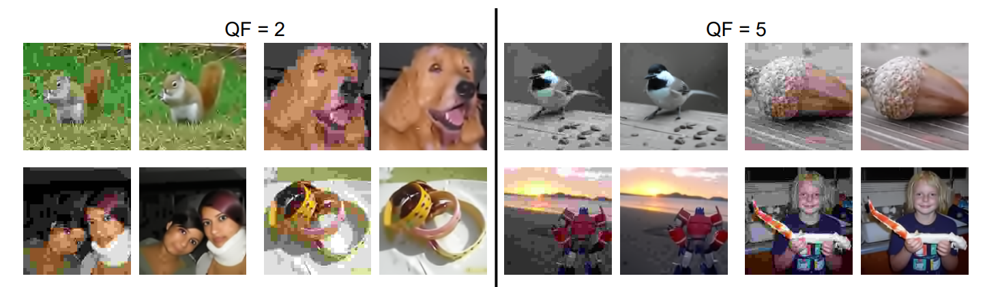

# JPEG Artifact Correction using Denoising Diffusion Restoration Models

[arXiv](https://arxiv.org/abs/2209.11888) | [PDF](https://arxiv.org/pdf/2209.11888.pdf)

[Bahjat Kawar](https://bahjat-kawar.github.io/)<sup>\* 1</sup>, [Jiaming Song](http://tsong.me)<sup>\* 2</sup>, [Stefano Ermon](http://cs.stanford.edu/~ermon)<sup>3</sup>, [Michael Elad](https://elad.cs.technion.ac.il/)<sup>1</sup><br />
<sup>1</sup> Technion, <sup>2</sup>NVIDIA, <sup>3</sup>Stanford University, <sup>\*</sup>Equal contribution.




We extend DDRM (Denoising Diffusion Restoration Models) for the problems of JPEG artifact correction and image dequantization.

## Running the Experiments
The code has been tested on PyTorch 1.8 and PyTorch 1.10. Please refer to `environment.yml` for a list of conda/mamba environments that can be used to run the code. The codebase is based heavily on the [original DDRM codebase](https://github.com/bahjat-kawar/ddrm).

### Pretrained models
We use pretrained models from [https://github.com/openai/guided-diffusion](https://github.com/openai/guided-diffusion), [https://github.com/pesser/pytorch_diffusion](https://github.com/pesser/pytorch_diffusion) and [https://github.com/ermongroup/SDEdit](https://github.com/ermongroup/SDEdit)

We use 1,000 images from the ImageNet validation set for comparison with other methods. The list of images is taken from [https://github.com/XingangPan/deep-generative-prior/](https://github.com/XingangPan/deep-generative-prior/)

The models and datasets are placed in the `exp/` folder as follows:
```bash
<exp> # a folder named by the argument `--exp` given to main.py
├── datasets # all dataset files
│   ├── celeba # all CelebA files
│   ├── imagenet # all ImageNet files
│   ├── ood # out of distribution ImageNet images
│   ├── ood_bedroom # out of distribution bedroom images
│   ├── ood_cat # out of distribution cat images
│   └── ood_celeba # out of distribution CelebA images
├── logs # contains checkpoints and samples produced during training
│   ├── celeba
│   │   └── celeba_hq.ckpt # the checkpoint file for CelebA-HQ
│   ├── diffusion_models_converted
│   │   └── ema_diffusion_lsun_<category>_model
│   │       └── model-x.ckpt # the checkpoint file saved at the x-th training iteration
│   ├── imagenet # ImageNet checkpoint files
│   │   ├── 256x256_classifier.pt
│   │   ├── 256x256_diffusion.pt
│   │   ├── 256x256_diffusion_uncond.pt
│   │   ├── 512x512_classifier.pt
│   │   └── 512x512_diffusion.pt
├── image_samples # contains generated samples
└── imagenet_val_1k.txt # list of the 1k images used in ImageNet-1K.
```

### Sampling from the model

The general command to sample from the model is as follows:
```
python main.py --ni --config {CONFIG}.yml --doc {DATASET} -i {IMAGE_FOLDER} --timesteps {STEPS} --init_timestep {INIT_T} --eta {ETA} --etaB {ETA_B} --deg {DEGRADATION} --num_avg_samples {NUM_AVG}
```
where the following are options
- `ETA` is the eta hyperparameter in the paper. (default: `1`)
- `ETA_B` is the eta_b hyperparameter in the paper. (default: `0.4`)
- `STEPS` controls how many timesteps used in the process. (default: `20`)
- `INIT_T` controls the timestep to start sampling from. (default: `300`)
- `NUM_AVG` is the number of samples per input to average for the final result. (default: `1`)
- `DEGREDATION` is the type of degredation used. (One of: `quant` for dequantization, or `jpegXX` for JPEG with quality factor `XX`, e.g. `jpeg80`)
- `CONFIG` is the name of the config file (see `configs/` for a list), including hyperparameters such as batch size and network architectures.
- `DATASET` is the name of the dataset used, to determine where the checkpoint file is found.
- `IMAGE_FOLDER` is the name of the folder the resulting images will be placed in (default: `images`)

For example, to use the default settings from the paper on the ImageNet 256x256 dataset, the problem of JPEG artifact correction for QF=80, and averaging 8 samples per input:
```
python main.py --ni --config imagenet_256.yml --doc imagenet -i imagenet --deg jpeg80 --num_avg_samples 8
```
The generated images are place in the `<exp>/image_samples/{IMAGE_FOLDER}` folder, where `orig_{id}.png`, `y0_{id}.png`, `{id}_-1.png` refer to the original, degraded, restored images respectively.

The config files contain a setting controlling whether to test on samples from the trained dataset's distribution or not.

## References and Acknowledgements
```
@inproceedings{kawar2022jpeg,
      title={JPEG Artifact Correction using Denoising Diffusion Restoration Models}, 
      author={Bahjat Kawar and Jiaming Song and Stefano Ermon and Michael Elad},
      booktitle={Neural Information Processing Systems (NeurIPS) Workshop on Score-Based Methods},
      year={2022}
}
```

```
@inproceedings{kawar2022denoising,
      title={Denoising Diffusion Restoration Models},
      author={Bahjat Kawar and Michael Elad and Stefano Ermon and Jiaming Song},
      booktitle={Advances in Neural Information Processing Systems},
      year={2022}
}
```

This implementation is based on / inspired by [https://github.com/bahjat-kawar/ddrm](https://github.com/bahjat-kawar/ddrm) 

## License

The code is released under the MIT License.